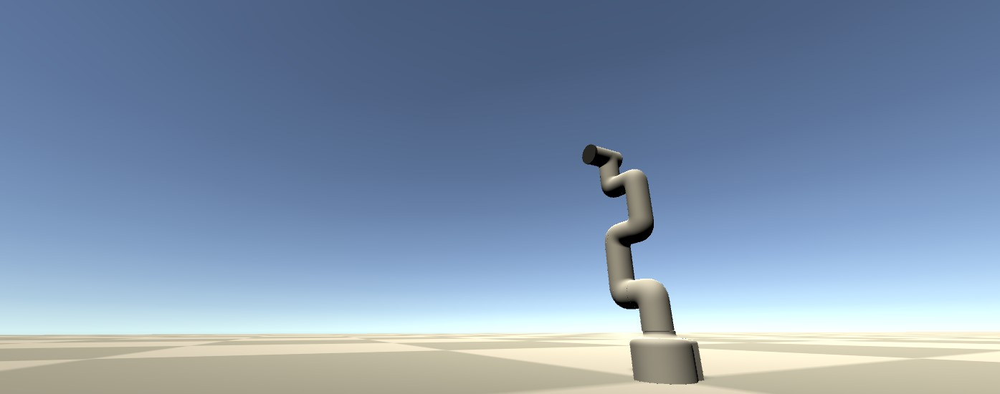
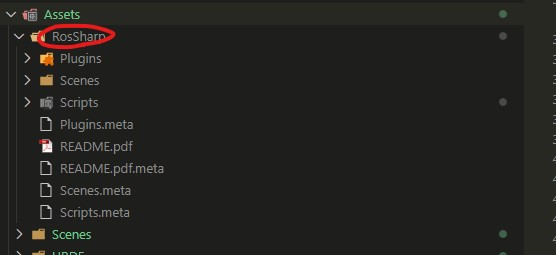
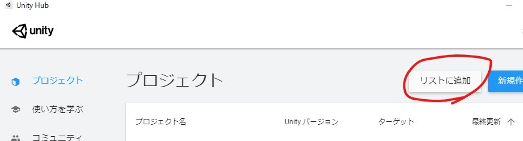

# myCobotをMoveItで動かしながらUnityで可視化する



## 概要
* MoveItでパスプランニングを実施。
* 実機に動作を流す。
* joint_statesを拾ってUnityで可視化。

## 検証環境
### Ubuntu

* Ubuntu 18.04（古くてごめんなさい）
* ROS Melodic（古くてごめんなさい）

### Windows

* Windows 10
* Unity 2019.2.15f1（古くてごめんなさい）

## セットアップ
### Ubuntu
* ROSがインストールされていることが前提。
* 追加パッケージとして、以下をインストールする。

```bash
sudo apt-get install ros-melodic-rosbridge-server
```

* myCobotはMoveitでUnity関係なく動作できる状態であること。

参考サイト（先人の方がとても良い記事を書いてくれているので参考にする）

> https://qiita.com/nisshan_/items/304cc8e1a2da7c2bebad  
> https://qiita.com/MeRT/items/77366486b120fa4a18c6

### Windows(Ubuntuでもいい)
Unityがインストールされている前提。

このリポジトリをClone。

```bash
git clone https://github.com/Ry0/mycobot_unity_ros_sharp.git
```

[ROS#公式リポジトリのRosSharpフォルダ](https://github.com/siemens/ros-sharp/tree/master/Unity3D/Assets/RosSharp)をAssetフォルダにまるっとコピーする。



動作を確認したときのcommit IDは[f469726](https://github.com/siemens/ros-sharp/commit/f469726d5dad3613d10c00d8f35e4c0050c2ac8b)。

コピー作業が完了したらUnity Hub上で、クローンしてきたフォルダを選択してリストに追加する。



追加後、プロジェクトを開く。

## 動作させる
### Ubuntu
myCobotがMoveitのGUIを使って動かせる状態にしておく。

このlaunchでunityとの接続を実施。

```bash
roslaunch rosbridge_server rosbridge_websocket.launch
```

Unity側でROS Coreが立ち上がっているIPアドレスを指定する箇所があるので、そこは環境に応じて変更する。


設定が完了したプレイボタンを押す。

## デモ


## 参考ページ

* https://github.com/siemens/ros-sharp/wiki